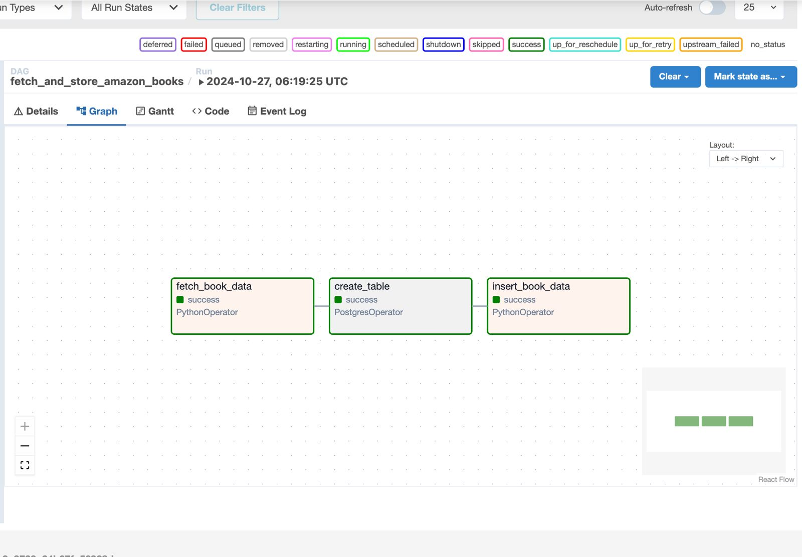
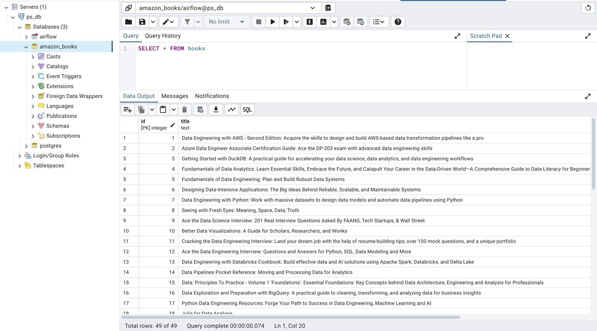

# Amazon Books Data Pipeline with Airflow and PostgreSQL

This project is an Airflow-based data pipeline that scrapes book information from Amazon, performs data transformation, and stores the data into a PostgreSQL database. This pipeline automates the ETL (Extract, Transform, Load) process using a Directed Acyclic Graph (DAG) with Airflow.

---

## Table of Contents
1. [Project Overview](#project-overview)
2. [Technologies Used](#technologies-used)
3. [Installation](#installation)
4. [Pipeline Structure](#pipeline-structure)
5. [DAG Configuration](#dag-configuration)
6. [Tasks](#tasks)
7. [Running the DAG](#running-the-dag)
8. [Screenshots](#screenshots)

---

## Project Overview
The pipeline follows the typical ETL process:
1. **Extract**: Retrieve book data from Amazon’s search page for “data engineering books”.
2. **Transform**: Clean and format the data.
3. **Load**: Insert the cleaned data into a PostgreSQL database.

---

## Technologies Used
- **Airflow**: Task scheduling and orchestration.
- **PostgreSQL**: Database for storing the extracted data.
- **Requests & BeautifulSoup**: For web scraping Amazon book data.
- **Docker**: To containerize the project (optional).
- **Pandas**: Data manipulation and cleaning.

---

## Installation
1. Clone the repository:
   ```bash
   git clone https://github.com/Mafarasya/Amazon_Books.git

---

## Pipeline structure
This DAG includes three main tasks:

- **Fetch Book Data**: Scrapes data for data engineering books from Amazon.
- **Create Table**: Creates a books table in PostgreSQL if it doesn’t already exist.
- **Insert Book Data**: Loads the transformed data into the PostgreSQL table.
  
---

## DAG Configuration

The DAG, `fetch_and_store_amazon_books`, is scheduled to run daily with a retry policy of 5 minutes between retries. The DAG configuration is as follows:

```python
default_args = {
    'owner': 'airflow',
    'depends_on_past': False,
    'start_date': datetime(2024, 10, 12),
    'retries': 1,
    'retry_delay': timedelta(minutes=5)
}

dag = DAG(
    'fetch_and_store_amazon_books',
    default_args=default_args,
    description='Simple DAG to fetch book data from Amazon and store it in PostgreSQL',
    schedule_interval=timedelta(days=1)
)
```
---

## Tasks

### fetch_book_data

- Scrapes Amazon’s search results for data engineering books.
- Uses BeautifulSoup to parse and extract title, author, price, and rating.
- Pushes the cleaned data to XCom for the next task.

### create_table

- Creates a PostgreSQL table named `books` to store book data.
- Ensures the table schema includes columns for title, author, price, and rating.

### insert_book_data

- Retrieves data from XCom and inserts it into the PostgreSQL `books` table.
- Uses PostgreSQL hooks to establish the database connection and execute insertion queries.

---

## Screenshots

- **Airflow DAG UI:** Show the structure and tasks of the DAG in the Airflow UI.

- **PostgreSQL Table Query Results:** Show the output of a query that verifies data in the books table.


---
